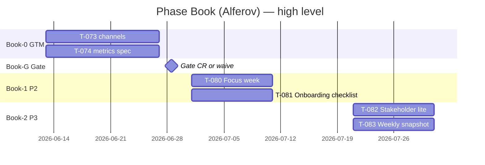
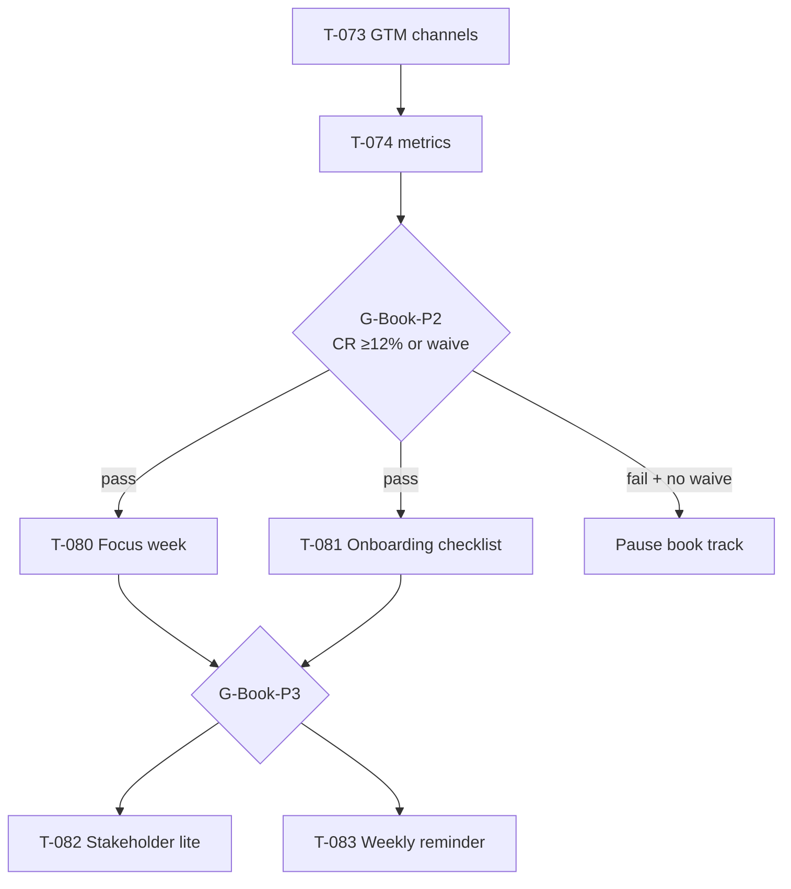

# План реализации — Phase Book (Alferov track)

**Версия:** 1.0  
**Владелец:** PM  
**Архитектор:** Pavel  
**Дата старта трека:** 2026-06-13  
**Последнее обновление:** 2026-06-13 (T-079 — PM plan + TZ)

> **Master plan (Phase 0–4):** [`implementation-plan.md`](./implementation-plan.md) — **не дублируется**; фазы 0–4 закрыты (M0 Go 2026-06-08).  
> **ТЗ book-features:** [`technical-specification-book-features.md`](./technical-specification-book-features.md)  
> **Источник идей:** [`manager-roundtable-report-2026-06-13.md`](./manager-roundtable-report-2026-06-13.md) · книга П. Алферова «Проектное управление: как правильно делать правильные вещи» (2024)

---

## Краткое резюме

| Параметр | Значение |
|----------|----------|
| **Цель трека** | 3–5 точечных улучшений из книги Алферова поверх MVP — **после** GTM-валидации |
| **North Star (retention)** | PM возвращается еженедельно: «Фокус недели» + снимок проекта меняют одно решение |
| **Gate book P2+** | Organic waitlist **CR ≥12%** (H1, 14 дней) **или** explicit waive Human |
| **Billing** | **Paused** — book track **не** включает checkout, webhook, Pro CTA |
| **Срок трека (ориентир)** | 6–8 недель от 2026-06-13 (параллельно GTM sprint 1–2) |

---

## Связь с Phase 0–4

| Артефакт Phase 0–4 | Роль в book track |
|--------------------|-------------------|
| DomainRadar + Zustand | База для «Фокус недели» (слабейший домен) |
| Onboarding 3 шага (T-009) | Расширение чек-листом «проработать проект» (T-081) |
| Export snapshot (T-042) | Основа weekly snapshot + reminder (T-083) |
| GTM sprint (T-073/T-074) | **P1 — продолжение Phase 4**, gate для book P2+ |
| PostHog stub (T-030) | События book-features — по ADR-002, OFF default |

---

## Обзор фаз book track

| Фаза | Название | Календарь (ориентир) | Критерий выхода |
|------|----------|----------------------|-----------------|
| **Book-0** | GTM + метрики (Phase 4 cont.) | 2026-06-13 — 2026-06-27 | T-073/T-074 DONE; первый weekly snapshot |
| **Book-G** | Gate evaluation | 2026-06-27 — 2026-06-30 | CR ≥12% **или** Human waive → T-080…T-081 READY |
| **Book-1** | P2 — фокус + онбординг | 2026-07-01 — 2026-07-18 | T-080, T-081 DONE; QA PASS |
| **Book-2** | P3 — стейкхолдеры + retention | 2026-07-21 — 2026-08-08 | T-082, T-083 DONE; dogfood optional |
| **Book-R** | Review + roadmap sync | 2026-08-11 | PM status; решение: scale / pause book scope |

---

## Gates (когда стартовать book-features)

| Gate | Условие | Разблокирует | Владелец |
|------|---------|--------------|----------|
| **G-Book-0** | T-073 ≥2 канала live; T-074 spec + snapshot #1 | Book-G review | Growth + PM |
| **G-Book-P2** | Waitlist CR **≥12%** (14d, organic) **или** Human **«waive book gate»** | T-080, T-081 → **READY** | PM + Human |
| **G-Book-P3** | T-080 **или** T-081 shipped + QA PASS; G-Book-P2 пройден | T-082, T-083 → **READY** | PM + QA |
| **G-Book-Stop** | 90d: waitlist &lt;50 **и** CR &lt;5% | **Pause** book track; pivot ICP/copy | PM + Human |

**Human waive:** явная запись в journal `orchestration-queue.md` — book P2 без CR (например, strategic dogfood приоритет).

**Billing:** не входит ни в один gate book track; T-069…T-071 остаются BACKLOG.

---

## WBS по ролям

### Book-0 — GTM + validation (2026-06-13 — 2026-06-27)

| Task | Роль | R | A | Deliverable |
|------|------|---|---|-------------|
| T-073 | GTM sprint 1 | Growth | Human | 2 канала, UTM, copy tests |
| T-074 | Waitlist metrics spec | PM + Growth | PM | KPI table, weekly snapshot template |
| T-078 | Staging smoke | QA | QA | qa-report subset PASS |
| T-076 | Live prompt regression | Senior PM + QA | Senior PM | OPTIONAL |
| T-075 | PostHog VPS | DevOps | Human | OPTIONAL |

### Book-G — Gate (2026-06-27 — 2026-06-30)

| Пакет | Роль | Deliverable |
|-------|------|-------------|
| Metrics review | PM + Growth | CR, signups, source breakdown |
| Gate memo | PM | G-Book-P2 pass/fail/waive в `pm-status.md` |
| Senior PM review | Senior PM | Prompt slice для «Фокус недели» (черновик до T-080) |

### Book-1 — P2 features (2026-07-01 — 2026-07-18)

| Task | Роль | R | A | C |
|------|------|---|---|---|
| T-080 «Фокус недели» | Developer | Developer | PM | Senior PM (prompt), UI/UX (card) |
| T-081 Onboarding checklist | Developer + UI/UX | Developer | PM | SME (copy items) |
| QA book P2 | QA | QA | PM | — |

### Book-2 — P3 features (2026-07-21 — 2026-08-08)

| Task | Роль | R | A | C |
|------|------|---|---|---|
| T-082 Stakeholder map lite | Developer + UI/UX | Developer | PM | SME |
| T-083 Weekly snapshot + reminder | Developer | Developer | PM | Growth (retention metric) |
| QA book P3 | QA | QA | PM | — |

### Book-R — Review (2026-08-11)

| Пакет | Роль | Deliverable |
|-------|------|-------------|
| Retention check | PM + Growth | WAU week-2 vs baseline |
| Scope decision | PM + Human | Continue / pause P4 book ideas |
| Doc sync | PM | `roadmap.md`, `pm-status.md`, queue |

---

## Зависимости (критический путь)

| ID | Зависимость |
|----|-------------|
| DEP-B1 | Book P2+ **blocked** until G-Book-P2 |
| DEP-B2 | T-081 **может** параллелить T-080 после gate (разные файлы) |
| DEP-B3 | T-082 **после** G-Book-P3 (не только gate P2) |
| DEP-B4 | T-083 использует T-042 export — **не** блокирует старт, но AC ссылается на существующий API |
| DEP-B5 | Senior PM prompt review T-080 — **до** merge Developer |
| DEP-B6 | Billing/auth — **вне** book track (Phase 5) |

---

## Риски book track

| ID | Риск | Митигация | Владелец |
|----|------|-----------|----------|
| RB1 | Строим book-features без PMF | Gate G-Book-P2; kill criteria 90d | PM |
| RB2 | «Учебник Алферова» в продукте | Anti-scope в TZ §1; max 1 вопрос/нед | Senior PM |
| RB3 | Scope creep (РИМ-III, CRM) | 3 поля stakeholder; 5–7 пунктов checklist | PM |
| RB4 | Retention не растёт | T-083 reminder — гипотеза; измерять WAU | Growth |
| RB5 | LLM generic «фокус» | Prompt slice + weakest domain binding | Senior PM |

---

## RACI (book track)

| Активность | PM | Senior PM | Developer | UI/UX | QA | Growth | Human |
|------------|:--:|:---------:|:---------:|:-----:|:--:|:------:|:-----:|
| Plan + TZ (T-079) | **R/A** | C | I | I | I | C | I |
| GTM gate | C | I | I | I | I | **R** | A |
| T-080 Focus | C | **R** (prompt) | **R** (code) | C | C | I | I |
| T-081 Onboarding | **A** | C | **R** | C | C | I | I |
| T-082 Stakeholders | C | C | **R** | C | C | I | I |
| T-083 Retention | **A** | I | **R** | C | C | C | I |
| Gate waive | **R** | I | I | I | I | C | **A** |

---

## Очередь задач (ссылка)

| ID | Задача | Статус (2026-06-13) |
|----|--------|---------------------|
| T-079 | PM: plan + TZ book track | **DONE** |
| T-073 | GTM sprint 1 | **DONE** |
| T-074 | Waitlist metrics spec | **DONE** |
| T-080 | «Фокус недели» | **DONE** (2026-06-13; G-Book-P2 waived) |
| T-081 | Onboarding checklist | **READY** |
| T-082 | Stakeholder map lite | **BACKLOG** (gate G-Book-P3) |
| T-083 | Weekly snapshot + reminder | **BACKLOG** (gate G-Book-P3) |

---

## История документа

| Дата | Автор | Изменение |
|------|-------|-----------|
| 2026-06-13 | PM | v1.0 — Phase Book track; gates; WBS; link Phase 0–4 |
