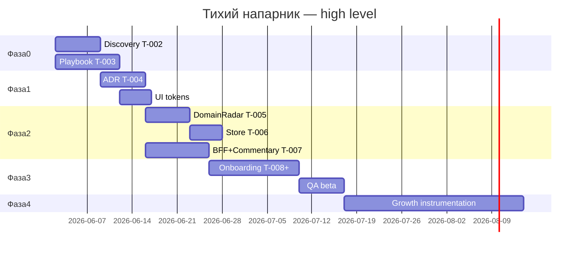

# План реализации — Тихий напарник (Quiet Partner)

**Версия:** 1.1  
**Владелец:** PM + Senior PM  
**Архитектор:** Pavel  
**Дата старта:** 2026-06-02 (неделя 1)  
**Последнее обновление:** 2026-05-30

> **Техническое задание:** [`technical-specification.md`](./technical-specification.md) — детальные AC для Developer, Architect, UI/UX, QA.  
> **Стек:** Next.js 16 App Router + TypeScript + Tailwind v4 + shadcn/ui + Zustand + Recharts. **Не Vite.**

---

## Краткое резюме

| Параметр | Значение |
|----------|----------|
| **Общий срок** | **14 недель** (фазы 0–4), ~3,5 FTE blended |
| **Первый shippable spike** | Недели 5–6 (DomainRadar + HealthCommentary) |
| **North Star (черновик)** | PM возвращается еженедельно, потому что radar + commentary изменили одно решение |
| **Валидация Phase 0** | Desk research, competitive scan, dogfood на проектах Human, воркшопы PM/Senior PM — **без внешних интервью** |

---

## Обзор фаз

| Фаза | Название | Длительность | Критерий выхода |
|------|----------|--------------|-----------------|
| **0** | Discovery и выравнивание | **2 недели** | ICP v1, playbook v0, черновик LLM ADR, stop/go |
| **1** | Foundation и архитектура | **2 недели** | Green build; ADR утверждён; design tokens stub |
| **2** | Технический spike (ядро MVP) | **3 недели** | DomainRadar + store + BFF + HealthCommentary demo |
| **3** | Onboarding + beta hardening | **3 недели** | Onboarding UI; dogfood beta; QA sign-off |
| **4** | Growth и instrumentation | **4 недели** | Landing, analytics, cost guardrails, roadmap Phase 5 |

**Итого: 14 недель** (календарь от 2026-06-02).

---

## WBS и вехи

| Веха | Неделя | Дата (ориентир) | Результат | Владелец |
|------|--------|-----------------|-----------|----------|
| M0 | 2 | 2026-06-13 | Go/no-go memo + обновлённый brief | PM / Human |
| M1 | 4 | 2026-06-27 | ADR-001 LLM BFF merged | Architect |
| M2 | 6 | 2026-07-11 | **Spike demo:** radar + commentary | Developer |
| M3 | 9 | 2026-08-01 | Onboarding path live (local/staging) | PM + Dev |
| M4 | 10 | 2026-08-08 | QA beta checklist PASS | QA |
| M5 | 14 | 2026-09-05 | Growth pack + cost dashboard | Growth + Dev |

---

## Детализация по фазам

### Фаза 0 — Discovery и выравнивание (2 недели, 2026-06-02 — 2026-06-13)

#### Ценность этапа

Снизить **неопределённость** (PMBOK Domain: *Неопределённость*, Principle: *Focus on value*) до инвестиций в код: зафиксировать ICP, метрики успеха и методологическую рамку PMBOK 7 без иллюзии сертификации. Принцип *Holistic view* — продукт с первого дня смотрит на 8 доменов, а не на exam checklist.

#### Что делаем

| Task ID | Пакет работ | Результат |
|---------|-------------|-----------|
| T-002 | ICP, JTBD, метрики, stop criteria | `product-brief.md` v1 |
| T-003 | Playbook v0 + review `getSystemPrompt()` | `pmbok-domain-playbook.md` v1 |
| — | Desk research: PM co-pilot, Notion PM, Linear, exam trainers | 1-pager competitive scan |
| — | Dogfood: прогон сценария на 1–2 проектах Human | заметки dogfood |
| — | Воркшоп PM + Senior PM (2×90 мин): tailoring matrix, anti-persona | протокол воркшопа |

**Не делаем:** внешние problem interviews, рекрутинг респондентов, Growth interview scripts.

#### Кто

| Пакет | R | A | C |
|-------|---|---|---|
| T-002 discovery | PM | Human | Senior PM, Growth |
| T-003 playbook | Senior PM | Human | PM, UI/UX |
| Desk research | PM | PM | Growth |
| Dogfood | Human | PM | Senior PM |
| Воркшопы | PM + Senior PM | PM | Human |

См. полную таблицу [RACI](#raci).

#### Когда

| Неделя | Календарь | Активности |
|--------|-----------|------------|
| N1 | 02.06–06.06 | T-002 kickoff; desk research; T-003 draft D1–D4 |
| N2 | 09.06–13.06 | Dogfood; воркшоп #1–2; T-003 D5–D8; M0 go/no-go |

#### Ссылки на ТЗ

- [§1 Назначение и область](technical-specification.md#1-назначение-и-область)
- [§8 Зависимости — DEP-5 (без интервью)](technical-specification.md#8-зависимости-и-ограничения)
- Playbook сигналы → [§3.2 DomainRadar пороги](technical-specification.md#32-фаза-2-domainradar)
- Prompt rules → [§3.5 HealthCommentary](technical-specification.md#35-фаза-2-healthcommentary)

---

### Фаза 1 — Foundation и архитектура (2 недели, 2026-06-16 — 2026-06-27)

#### Ценность этапа

Заложить **качество** и **ответственность** (Principles: *Quality*, *Be a diligent steward*): безопасный LLM BFF, threat model, design tokens — до vertical slice. Domain *Планирование* — WBS и ADR до spike.

#### Что делаем

| Task ID | Пакет работ | Результат |
|---------|-------------|-----------|
| T-004 | ADR LLM BFF, env, rate limits | `knowledge-base/adr-001-llm-bff.md` |
| — | `architecture.md`, threat model (key leakage) | Architect doc |
| — | Design tokens + wireframe DomainRadar | UI spec |
| T-001 | ✅ Bootstrap (DONE) | repo green |

#### Кто

| Пакет | R | A |
|-------|---|---|
| T-004 ADR | Architect | Human |
| Threat model | Architect | QA |
| Design tokens | UI/UX | PM |
| CI/build | Developer | Developer |

#### Когда

| Неделя | Календарь | Активности |
|--------|-----------|------------|
| N3 | 16.06–20.06 | T-004 draft; architecture.md; tokens stub |
| N4 | 23.06–27.06 | ADR review; wireframe 8 wedges; M1 |

#### Ссылки на ТЗ

- [§2 Архитектура и стек](technical-specification.md#2-архитектура-и-стек)
- [§3.1 Фаза 1 — Foundation](technical-specification.md#31-фаза-1-foundation)
- [§4.1 Безопасность](technical-specification.md#4-нефункциональные-требования)

---

### Фаза 2 — Технический spike (3 недели, 2026-06-30 — 2026-07-18)

#### Ценность этапа

**Vertical slice ценности** (Domain: *Поставка*): пользователь видит 8-domain radar и получает actionable commentary. Principle *Focus on value* — один экран меняет фокус PM на день. Измерение (*Measurement*) — baseline API cost.

Vertical slice: **DomainRadar → Zustand → `/api/advisor/health-commentary` → HealthCommentary**

#### Что делаем

| Task ID | Пакет работ | Результат |
|---------|-------------|-----------|
| T-005 | DomainRadar (mock → store) | компонент + a11y |
| T-006 | Zustand store + types | `lib/store/` |
| T-007 | BFF route + commentary card | API + UI |
| — | Prompt integration tests (manual) | QA + Senior PM checklist |

#### Кто

| Пакет | R | A |
|-------|---|---|
| T-005 radar | Developer + UI/UX | Developer |
| T-006 store | Developer | Developer |
| T-007 BFF + UI | Developer | Developer |
| Prompt QA | Senior PM + QA | Senior PM |

#### Когда

| Неделя | Календарь | Активности |
|--------|-----------|------------|
| N5 | 30.06–04.07 | T-005 radar; T-007 BFF skeleton |
| N6 | 07.07–11.07 | T-006 store; T-007 UI; **M2 demo** |
| N7 | 14.07–18.07 | a11y pass; cost sample 100 calls; bugfix |

#### Ссылки на ТЗ

- [§3.2 DomainRadar](technical-specification.md#32-фаза-2-domainradar)
- [§3.3 Zustand store](technical-specification.md#33-фаза-2-zustand-store)
- [§3.4 BFF `/api/advisor`](technical-specification.md#34-фаза-2-bff-apiadvisor)
- [§3.5 HealthCommentary](technical-specification.md#35-фаза-2-healthcommentary)
- [§5 Модель данных](technical-specification.md#5-модель-данных)
- [§6 API контракты](technical-specification.md#6-api-контракты)
- [§7 QA — компоненты T-005…T-007](technical-specification.md#7-критерии-приёмки)

---

### Фаза 3 — Onboarding + beta hardening (3 недели, 2026-07-21 — 2026-08-08)

#### Ценность этапа

Сократить **time to first radar** &lt;3 мин (Domain: *Stakeholders* — onboarding как первый контакт). *Adaptability* — tailoring по delivery approach. Beta через **dogfood** и внутреннюю обратную связь (👍), без формальных интервью.

#### Что делаем

| Task ID | Пакет работ | Результат |
|---------|-------------|-----------|
| T-008 | Onboarding spec → UI (T-009 future) | flow doc + UI |
| — | Error states, disclaimer, a11y pass | QA checklist |
| — | Dogfood beta: 3–5 сессий на реальных проектах Human | feedback log |

#### Кто

| Пакет | R | A |
|-------|---|---|
| T-008 spec + UI | PM + Developer | PM |
| a11y / errors | UI/UX + QA | QA |
| Dogfood beta | Human + PM | Human |

#### Когда

| Неделя | Календарь | Активности |
|--------|-----------|------------|
| N8–N9 | 21.07–01.08 | T-008 spec; UI implementation; **M3** |
| N10 | 04.08–08.08 | QA beta; dogfood sessions; **M4** |

#### Ссылки на ТЗ

- [§3.6 Onboarding](technical-specification.md#36-фаза-3-onboarding)
- [§7.6 Onboarding AC](technical-specification.md#7-критерии-приёмки)
- [§4.2 a11y](technical-specification.md#4-нефункциональные-требования)

---

### Фаза 4 — Growth и instrumentation (4 недели, 2026-08-11 — 2026-09-05)

#### Ценность этапа

**Измерение** (Domain: *Measurement*) и unit economics: landing hypothesis, OSS analytics ADR, API cost alerts. Подготовка Phase 5 (auth, persistence) без scope creep.

#### Что делаем

| Пакет | Результат |
|-------|-----------|
| Landing + waitlist hypothesis | Growth one-pager |
| OSS analytics (PostHog self-host ADR) | Architect + Dev |
| API cost alerts + per-user budget | Dev + Architect |
| Roadmap Phase 5 (auth, persistence) | PM doc |

#### Кто

| Пакет | R | A |
|-------|---|---|
| Landing | Growth | Human |
| Analytics ADR | Architect | Architect |
| Cost guards | Developer | Architect |
| Phase 5 roadmap | PM | Human |

#### Когда

| Неделя | Календарь | Активности |
|--------|-----------|------------|
| N11–N12 | 11.08–22.08 | Landing draft; analytics ADR |
| N13–N14 | 25.08–05.09 | Cost dashboard; Phase 5 scope; **M5** |

#### Ссылки на ТЗ

- [§4.3 Performance](technical-specification.md#4-нефункциональные-требования)
- [§8 DEP-7, DEP-8 (Phase 5+)](technical-specification.md#8-зависимости-и-ограничения)
- [§9 Трассировка Phase 4](technical-specification.md#9-трассировка)

---

## Реестр рисков (≥8)

| ID | Риск | В | И | Домен PMBOK | Митигация | Владелец |
|----|------|---|---|-------------|-----------|----------|
| R1 | **Иллюзия соответствия PMBOK** — пользователи думают, что продукт сертифицирует | С | В | Неопределённость, Stakeholders | Persistent disclaimer; review copy Senior PM; никогда «PMI approved» | Senior PM |
| R2 | **Перерасход API** (DeepSeek/Gemini) | С | С | Измерение | BFF rate limits; token caps; cache; метрика cost/week | Architect |
| R3 | **Alert fatigue** — все домены red/amber | В | С | Поставка, Измерение | Max 1 red highlight; commentary — вопросы, не тревоги | Senior PM + UI |
| R4 | **Нет ICP** — строим для exam prep аудитории | С | В | Stakeholders | T-002 desk research + dogfood; anti-persona в brief; stop criteria неделя 4 | PM |
| R5 | **Утечка API key** в client bundle | Н | В | Неопределённость | ADR: server-only; no `NEXT_PUBLIC_*`; CI grep | Architect |
| R6 | **Scope creep** (Jira sync, multi-tenant) | В | С | Планирование | MVP In/Out в brief; grooming queue; sign-off Human Phase 5+ | PM |
| R7 | **Variance качества LLM** — generic или вредный совет | С | В | Команда, Неопределённость | Questions-first prompt; human-in-loop; block medical/legal; sample log review | Senior PM |
| R8 | **Dogfood bias** — validation только на проектах Human | С | С | Stakeholders | Явно помечать bias в brief; competitive scan; stop/go M0 | PM |
| R9 | **a11y gaps Recharts/radar** | С | Н | Поставка | SVG labels, table fallback, QA checklist | UI/UX + QA |

**Практики домена Неопределённость:** pre-mortem на M0; review рисков на каждом phase gate; явные assumptions в HealthCommentary.

---

## Матрица tailoring (predictive / adaptive / hybrid)

| Измерение | Predictive | Adaptive | Hybrid |
|-----------|------------|----------|--------|
| **Горизонт планирования** | Baseline + milestones | Rolling 2-week | Baseline для контрактов + rolling internal |
| **Веса DomainRadar** | D4 Planning, D6 Delivery +15% | D2 Team, D8 Uncertainty +15% | User picks per workstream |
| **Onboarding вопросы** | Scope, critical path, gates | WIP, iteration goal, retro | Split «client-facing / internal» |
| **HealthCommentary** | Variance to plan | Flow / blockers | «Which track is failing?» |
| **Cadence релизов продукта** | Bi-weekly | Weekly | Bi-weekly + hotfix |
| **Глубина документации** | ADR-heavy | Playbook + spike notes | ADR для LLM only |

**Default до T-002:** **Hybrid** (гипотеза ICP — PM агентства).

---

## PMBOK 7 — mapping по фазам

### Принципы (выборочно)

| Принцип | Как воплощает продукт | Фаза |
|---------|----------------------|------|
| Be a diligent steward | Прозрачные лимиты AI, без ложного compliance | 0, 3 |
| Focus on value | Radar подсвечивает домены, блокирующие value | 2, 3 |
| Holistic view | 8-domain radar vs single checklist | 2 |
| Quality | QA gates, a11y, prompt review | 1–3 |
| Accountability | User owns scores; AI задаёт вопросы | 0–4 |
| Adaptability | Tailoring matrix по delivery approach | 0, 3 |

### 8 performance domains — акцент по фазам

| Домен (RU) | Фаза 0 | Фаза 1 | Фаза 2 | Фаза 3 | Фаза 4 |
|------------|--------|--------|--------|--------|--------|
| Заинтересованные стороны | ICP, desk research | — | — | Dogfood feedback | Landing messaging |
| Команда | RACI | Dev capacity | Spike pairing | Beta support | — |
| Подход и жизненный цикл | Tailoring matrix | ADR process | Spike = adaptive slice | Onboarding path | — |
| Планирование | WBS, этот doc | Architecture | Task breakdown | Beta plan | Roadmap Phase 5 |
| Работа проекта | Queue hygiene | CI/build | Implementation | Bugfix | Instrumentation |
| Поставка | — | M1 | **M2 demo** | M3 onboarding | M5 growth |
| Измерение | Success metrics | Cost model | API metrics | 👍 rate | Analytics |
| Неопределённость | Risk register | Threat model | LLM variance | Dogfood learnings | Cost alerts |

---

## RACI {#raci}

| Активность | PM | Senior PM | Architect | Developer | UI/UX | QA | Growth | Human |
|------------|:--:|:---------:|:---------:|:---------:|:-----:|:--:|:------:|:-----:|
| Product brief и queue | **R/A** | C | I | I | I | I | C | A |
| PMBOK playbook | C | **R/A** | I | I | C | I | I | A |
| LLM ADR и security | C | C | **R/A** | C | I | C | I | A |
| DomainRadar / store / API | I | C | C | **R/A** | C | C | I | I |
| Design tokens и layout | C | C | I | C | **R/A** | C | I | I |
| QA / beta sign-off | C | I | I | C | C | **R/A** | C | A |
| Desk research и landing | C | C | I | I | C | I | **R/A** | A |
| Go/no-go Phase 1+ | **R** | C | C | I | I | I | C | **A** |

*R = Responsible, A = Accountable, C = Consulted, I = Informed*

---

## Стек (канонический)

| Слой | Выбор |
|------|-------|
| Framework | **Next.js 16** App Router (не Vite) |
| Language | TypeScript |
| Styling | Tailwind CSS v4, shadcn/ui |
| State | Zustand |
| Charts | Recharts (DomainRadar) |
| LLM | DeepSeek primary, Gemini optional — **только BFF** |
| Persistence | Local/session Phase 2; PostgreSQL Phase 5+ (TBD) |
| Deploy | Vercel или VPS (ADR Phase 1) |

См. [`tech-stack.md`](./tech-stack.md).

---

## Зависимости и допущения

- Human предоставляет `DEEPSEEK_API_KEY` для spike (не коммитить).
- Senior PM доступен для playbook + prompt review (не full-time SME).
- Phase 0 validation: desk research + dogfood — **без внешних интервью**.
- English UI отложен до RU pilot validation.

---

## Phase gates (go / no-go)

| Gate | Критерии для перехода |
|------|------------------------|
| **G0→1** | ICP hypothesis + desk research + competitive scan + playbook v0 draft **или** explicit waive Human |
| **G1→2** | ADR-001 approved; secrets pattern documented |
| **G2→3** | Spike demo reviewed; commentary useful в 3/5 internal dogfood trials |
| **G3→4** | QA PASS; 👍 ≥50% на dogfood beta |
| **G4→5** | Unit economics sketch; Human approves Phase 5 scope |

**Stop criteria (Phase 0):** Desk research + dogfood не подтверждают проблему **и** PM (Human) отказывается использовать weekly → **pause** co-pilot, document learnings, repo archived.

---

## Ближайшие задачи очереди

1. **T-002** PM — discovery (READY) → [`technical-specification.md`](./technical-specification.md)
2. **T-003** Senior PM — playbook v1 (READY)
3. **T-004** Architect — LLM ADR (READY)

---

## История документа

| Дата | Автор | Изменение |
|------|-------|-----------|
| 2026-05-30 | Developer | v1.0 plan, phases 0–4, risks, RACI, PMBOK map |
| 2026-05-30 | PM | v1.1: полный RU; ТЗ + anchors; без Banya/interviews; R8 dogfood bias |
