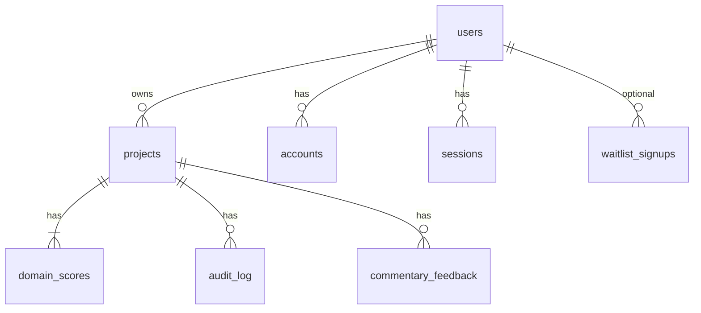

# Phase 5 — PostgreSQL schema draft (T-034)

**Версия:** 0.2 (Drizzle spike)  
**Дата:** 2026-06-07  
**Статус:** **Spike DONE (T-034)** — Drizzle types in [`lib/db/schema.ts`](../lib/db/schema.ts); no migrations / live DB  
**Владелец:** Developer (spike) + Architect review

> Черновик отражает Zustand store ([`lib/store/useProjectStore.ts`](../lib/store/useProjectStore.ts)) и Auth.js tables. **Не запускать** `drizzle-kit push` / SQL до `DATABASE_URL` + Human scope.

---

## TL;DR

| Область | Таблицы |
|---------|---------|
| Auth (Auth.js) | `users`, `accounts`, `sessions`, `verification_tokens` |
| App | `projects`, `domain_scores`, `audit_log`, `commentary_feedback`, `waitlist_signups` |
| Ops | `token_usage_daily` (optional — или Redis для T-036) |

**Host ADR (P5-ADR-2):** Neon serverless Postgres (draft lean) vs Supabase — Architect decision parallel to T-033.

---

## ER sketch



---

## Auth.js core (standard adapter)

```sql
-- Draft only — align with @auth/prisma-adapter or Drizzle adapter choice

CREATE TABLE users (
  id            UUID PRIMARY KEY DEFAULT gen_random_uuid(),
  name          TEXT,
  email         TEXT UNIQUE NOT NULL,
  email_verified TIMESTAMPTZ,
  image         TEXT,
  created_at    TIMESTAMPTZ NOT NULL DEFAULT now()
);

CREATE TABLE accounts (
  id                  UUID PRIMARY KEY DEFAULT gen_random_uuid(),
  user_id             UUID NOT NULL REFERENCES users(id) ON DELETE CASCADE,
  type                TEXT NOT NULL,
  provider            TEXT NOT NULL,
  provider_account_id TEXT NOT NULL,
  -- oauth token columns omitted in draft
  UNIQUE (provider, provider_account_id)
);

CREATE TABLE sessions (
  id            UUID PRIMARY KEY DEFAULT gen_random_uuid(),
  session_token TEXT UNIQUE NOT NULL,
  user_id       UUID NOT NULL REFERENCES users(id) ON DELETE CASCADE,
  expires       TIMESTAMPTZ NOT NULL
);

CREATE TABLE verification_tokens (
  identifier TEXT NOT NULL,
  token      TEXT NOT NULL,
  expires    TIMESTAMPTZ NOT NULL,
  PRIMARY KEY (identifier, token)
);
```

---

## App tables

### `projects`

Maps `ProjectProfile` + ownership.

```sql
CREATE TABLE projects (
  id                 UUID PRIMARY KEY DEFAULT gen_random_uuid(),
  user_id            UUID NOT NULL REFERENCES users(id) ON DELETE CASCADE,
  name               TEXT NOT NULL DEFAULT 'Мой проект',
  delivery_approach  TEXT NOT NULL CHECK (delivery_approach IN ('predictive', 'adaptive', 'hybrid')),
  phase              TEXT,
  workstream_count   INT,
  locale             TEXT NOT NULL DEFAULT 'ru' CHECK (locale IN ('ru', 'en')),
  imported_from_ls   BOOLEAN NOT NULL DEFAULT false,
  created_at         TIMESTAMPTZ NOT NULL DEFAULT now(),
  updated_at         TIMESTAMPTZ NOT NULL DEFAULT now()
);

CREATE INDEX idx_projects_user_id ON projects(user_id);
```

**MVP rule:** 1 active project per user; multi-project → Phase 6.

### `domain_scores`

Maps `domains: Record<DomainId, DomainHealth>` — 8 rows per project.

```sql
CREATE TABLE domain_scores (
  project_id   UUID NOT NULL REFERENCES projects(id) ON DELETE CASCADE,
  domain_id    TEXT NOT NULL CHECK (domain_id ~ '^D[1-8]$'),
  value        SMALLINT NOT NULL CHECK (value BETWEEN 0 AND 100),
  updated_at   TIMESTAMPTZ NOT NULL DEFAULT now(),
  PRIMARY KEY (project_id, domain_id)
);
```

### `audit_log`

Maps `AuditLogEntry[]`.

```sql
CREATE TABLE audit_log (
  id          UUID PRIMARY KEY DEFAULT gen_random_uuid(),
  project_id  UUID NOT NULL REFERENCES projects(id) ON DELETE CASCADE,
  action      TEXT NOT NULL,
  details     TEXT,
  created_at  TIMESTAMPTZ NOT NULL DEFAULT now()
);

CREATE INDEX idx_audit_log_project_created ON audit_log(project_id, created_at DESC);
```

### `commentary_feedback`

Aggregate counters + optional event log (North Star 👍 rate).

```sql
CREATE TABLE commentary_feedback (
  id          UUID PRIMARY KEY DEFAULT gen_random_uuid(),
  project_id  UUID NOT NULL REFERENCES projects(id) ON DELETE CASCADE,
  kind        TEXT NOT NULL CHECK (kind IN ('useful', 'not_useful')),
  created_at  TIMESTAMPTZ NOT NULL DEFAULT now()
);
```

### `waitlist_signups`

Replaces demo ack (T-044); links email to user on first login.

```sql
CREATE TABLE waitlist_signups (
  id          UUID PRIMARY KEY DEFAULT gen_random_uuid(),
  email       TEXT UNIQUE NOT NULL,
  user_id     UUID REFERENCES users(id) ON DELETE SET NULL,
  source      TEXT DEFAULT 'waitlist',
  created_at  TIMESTAMPTZ NOT NULL DEFAULT now()
);
```

---

## Token usage (optional Postgres vs Redis)

ADR-001 notes Redis for Phase 5. If Postgres-only MVP:

```sql
CREATE TABLE token_usage_daily (
  user_id       UUID NOT NULL REFERENCES users(id) ON DELETE CASCADE,
  usage_date    DATE NOT NULL,
  tokens_used   INT NOT NULL DEFAULT 0,
  request_count INT NOT NULL DEFAULT 0,
  PRIMARY KEY (user_id, usage_date)
);
```

**Recommendation:** Redis/Upstash for rate limit hot path (T-036); this table for audit/reports only.

---

## Migration from localStorage (P5-ADR-3)

| LS key / field | Target |
|----------------|--------|
| `projectProfile.name` | `projects.name` |
| `projectProfile.deliveryApproach` | `projects.delivery_approach` |
| `domains[D1..D8].value` | `domain_scores` rows |
| `auditLog[]` | `audit_log` (cap 100 recent) |
| `commentaryFeedback` counts | derived from events or seed rows |

Import endpoint: idempotent on `user_id` — second import returns 409.

---

## Indexes & RLS note

- **Neon/Supabase:** enable RLS on `projects`, `domain_scores` — `user_id = auth.uid()` equivalent via app layer if Auth.js only
- **Backup:** daily pg_dump per DevOps runbook (post ADR)

---

## Out of scope (draft)

- Multi-tenant orgs / teams
- Billing / subscriptions
- Full commentary text storage (LLM responses ephemeral unless PM decides)

---

## Next steps

1. ~~Architect sign-off ADR-003~~ ✅ Accepted 2026-06-07
2. ~~ORM: **Drizzle**~~ ✅ `lib/db/schema.ts` (T-034 DONE)
3. P5-ADR-2: Neon vs Supabase host — Architect + Human
4. T-036 Redis/Upstash rate limit; T-035 activation (`AUTH_ENABLED=true`) after `DATABASE_URL`

---

## Связи

- [`knowledge-base/adr-003-auth-phase5.md`](../knowledge-base/adr-003-auth-phase5.md)
- [`docs/roadmap-phase5.md`](./roadmap-phase5.md)
- [`docs/technical-specification.md`](./technical-specification.md) §8 DEP-8
