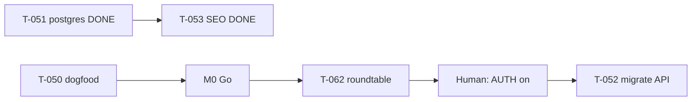

# Раздача задач — Quiet Partner

**Дата:** 2026-06-07 (Sprint 5 — T-051 activation DONE; T-053 SEO DONE; **T-059…T-061 M0 prep DONE**)  
**Gate:** G2→3 (dogfood + M0 Human) · G4→5 prep **active** (DB live; AUTH OFF)  
**Канон очереди:** [`orchestration-queue.md`](../orchestration-queue.md)  
**PM status:** [`pm-status.md`](./pm-status.md)  
**Governance:** [`pm-governance.md`](./pm-governance.md)  
**Staging:** https://quiet-partner.vercel.app

---

## Режим PM-led (2026-06-07)

**Sprint 5:** T-051 postgres **ACTIVATED** · T-053 SEO **DONE** · T-056 auth runbook **DONE** · AUTH **OFF**.  
**Human MUST (gate):** dogfood #5 / waiver · M0 sign-off · **T-062: дата roundtable + имена коллег PM/РП**.  
**Human MUST (Phase 5):** `AUTH_ENABLED=true` + `AUTH_SECRET` когда готов ([`auth-activation-runbook.md`](./auth-activation-runbook.md)).  
**Human OPTIONAL:** PostHog VPS (T-048) · live LLM regression (T-049).

---

## Владельцы — активные

| Владелец | Task | Статус | Следующий шаг |
|----------|------|--------|---------------|
| **Human** | T-062 M0 roundtable | **READY** | Дата + invite [`m0-roundtable-invite-list.md`](./m0-roundtable-invite-list.md) |
| **Human** | T-050 dogfood #5 / waiver | BACKLOG | +1 useful или waiver G2→3 |
| **Human** | T-015 M0 sign-off | BACKLOG | Go/Pause/Pivot в memo footer |
| **Human** | Auth activation | BACKLOG | `AUTH_ENABLED=true` per runbook |
| **Developer** | T-052 migrate-from-local | BACKLOG | AUTH on + DB live |
| **DevOps** | T-048 PostHog VPS | BACKLOG | OPTIONAL |
| **Senior PM + QA** | T-049 live LLM regression | BACKLOG | OPTIONAL |
| **PM** | T-062 roundtable facilitation | **READY** | Agenda §8 journal after Human sets date |
| **PM** | T-057 auth QA checklist extension | BACKLOG | docs when AUTH near |

---

## Без Human (закрыто)

| Кто | Task | Статус |
|-----|------|--------|
| Developer | T-001…T-043 | ✅ DONE |
| IT-Architect | T-033 ADR-003 · T-047 ADR-004 | ✅ DONE |
| Developer | T-034…T-036 Phase 5 scaffold | ✅ DONE |
| Developer | T-044 waitlist API + form wire | ✅ DONE |
| PM + Developer | T-045 localStorage migrate design | ✅ DONE |
| QA | T-046 Phase 5 prep checklist | ✅ DONE |
| Developer + Human | T-051 Drizzle + waitlist postgres + activation | ✅ DONE |
| PM | T-054 competitive scan finalize | ✅ DONE |
| PM | T-055 M0 sign-off checkbox | ✅ DONE |
| Growth + Dev | T-053 landing SEO | ✅ DONE |
| PM | T-056 auth activation runbook | ✅ DONE |
| SME + PM | T-059 market research Phase 4 | ✅ DONE |
| SME + PM | T-060 financial model M0 | ✅ DONE |
| Growth | T-061 GTM roundtable brief | ✅ DONE |

---

## Только Human (Pavel)

| # | Task | Действие | Артефакт |
|---|------|----------|----------|
| D1 | T-050 | Dogfood **#5** (+1 useful) **или** waiver G2→3 | §guides + log |
| D2 | T-015 | **Go / Pause / Pivot** + sign-off | [`m0-go-no-go-memo.md`](./m0-go-no-go-memo.md) |
| D3 | Phase 5 auth | `AUTH_ENABLED=true` + `AUTH_SECRET` | [`auth-activation-runbook.md`](./auth-activation-runbook.md) |
| D4 | Billing | Stripe / subscriptions | Out of MVP |

---

## WBS — Sprint 5 (текущий)

| Владелец | Deliverable | Статус |
|----------|-------------|--------|
| Human | T-051 `DATABASE_URL` + postgres waitlist | ✅ |
| Growth + Dev | T-053 SEO meta/OG/robots/sitemap | ✅ |
| PM | T-056 auth runbook | ✅ |
| QA | qa-report post-postgres PASS | ✅ |
| Human | dogfood #5 / M0 | ⬜ |
| PM + Human | T-062 M0 roundtable | ⬜ date TBD |

---

## Journal

| Дата | Событие |
|------|---------|
| 2026-06-07 | Phase 5 prep T-033…T-036 DONE |
| 2026-06-07 | T-044…T-047 DONE; build/lint; deploy staging |
| 2026-06-07 | T-051 code DONE; activation BLOCKED — no DATABASE_URL |
| 2026-06-07 | PM sprint 4: T-053…T-055 groom |
| 2026-06-07 | **Sprint 5:** T-051 activation DONE; T-053 SEO; T-056 runbook; qa post-postgres PASS |
| 2026-06-07 | **M0 prep:** T-059 market research · T-060 financial model · T-061 GTM brief **DONE** |

---

## Порядок

