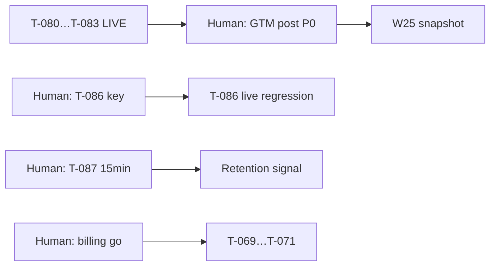

# Раздача задач — Quiet Partner

**Дата:** 2026-06-13 (Phase post-book — **T-080…T-083 live**; DeepSeek fallback)  
**Gate:** **G-Book-0 PASS** · **G-Book-P2 WAIVED** · **G-Book-P3 compile PASS** · prod deploy **DONE**  
**Канон очереди:** [`orchestration-queue.md`](../orchestration-queue.md)  
**PM status:** [`pm-status.md`](./pm-status.md) v4.9  
**Next steps (Pavel):** [`pm-next-steps-2026-06-13.md`](./pm-next-steps-2026-06-13.md)  
**Governance:** [`pm-governance.md`](./pm-governance.md)  
**Prod:** https://quiet-partner.vercel.app (book features live; T-076 live BLOCKED)

---

## Режим PM-led (2026-06-13)

**Phase post-book:** T-080…T-083 **live** on prod. **Traction P0:** Human GTM posting. **DeepSeek P1:** T-086 key rotate (fallback on live BFF).  
**Human MUST (billing):** «можно подключать» YooKassa → T-069…T-071. **Paused.**  
**Human OPTIONAL:** PostHog VPS (T-075) · dogfood #5 (T-077) · T-088 git hygiene.  
**Defaults:** `BILLING_ENABLED=false` · `AUTH_ENABLED=false` · `POSTHOG_DISABLED=true`.

---

## Владельцы — активные

| Владелец | Task | Статус | Следующий шаг |
|----------|------|--------|---------------|
| **Human** | GTM posting (T-073 drafts) | **P0 Pending** | [`gtm-sprint1-drafts-T-073.md`](./gtm-sprint1-drafts-T-073.md) |
| **Human** | T-086 DeepSeek key rotate | **P1 BLOCKED** | Vercel env → re-run S1–S4 |
| **Human** | T-087 Book dogfood 15 min | **Ready for Human** | [`dogfood-book-features-guide.md`](./dogfood-book-features-guide.md) |
| **Growth** | Weekly snapshot W25 | **READY** | After Human posts |
| **Senior PM + QA** | T-086 live regression | **BLOCKED** | After Human key fix |
| **PM** | T-087 protocol + pm-next-steps | **✅ DONE** | Human session |
| **QA + PM** | G-Book-P3 browser smoke prod | **READY** | qa-report §book |
| **DevOps** | T-075 PostHog VPS | **READY** | OPTIONAL |
| **Developer** | T-088 git hygiene | **READY** | OPTIONAL |
| **Human** | T-077 Dogfood #5 | BACKLOG | OPTIONAL |
| **Human** | Billing activation | BACKLOG | Paused |

---

## Закрыто (T-001…T-083 except follow-ups)

| Кто | Scope | Статус |
|-----|-------|--------|
| Developer | T-001…T-068 MVP + Phase 5 scaffold + **T-080…T-083 book** | ✅ DONE |
| IT-Architect | T-033, T-047, T-064 ADRs | ✅ DONE |
| PM | T-062 M0 · T-067 Go · T-072 · T-079 · **T-087 guide** | ✅ DONE |
| Growth | T-019, T-053, T-061, **T-073** | ✅ DONE |
| PM + Growth | **T-074** waitlist metrics | ✅ DONE |
| QA | **T-078** staging · T-076 doc (live BLOCKED) | ✅ / BLOCKED |
| SME + PM | T-059, T-060 | ✅ DONE |

---

## Только Human (Pavel)

| # | Task | Действие | Артефакт |
|---|------|----------|----------|
| H1 | **GTM post** | Copy-paste LinkedIn #1 + community (UTM) | [`gtm-sprint1-drafts-T-073.md`](./gtm-sprint1-drafts-T-073.md) |
| H2 | **T-086 DeepSeek** | Rotate/verify key in Vercel; no redeploy required | [`deploy-staging.md`](./deploy-staging.md) |
| H3 | **T-087 dogfood** | 15-min book walkthrough | [`dogfood-book-features-guide.md`](./dogfood-book-features-guide.md) |
| H4 | Billing | «можно подключать» YooKassa | [`billing-russia-runbook.md`](./billing-russia-runbook.md) — **paused** |
| H5 | Auth | `AUTH_ENABLED=true` when ready | [`auth-activation-runbook.md`](./auth-activation-runbook.md) |
| H6 | T-077 | Dogfood **#5** | OPTIONAL |
| H7 | T-075 | VPS credentials PostHog | OPTIONAL |

---

## WBS — 2 нед (2026-06-13 → 2026-06-27)

| Владелец | Deliverable | Статус |
|----------|-------------|--------|
| Human | GTM post #1 + community | ⬜ **P0 critical path** |
| Human | T-086 DeepSeek key rotate | ⬜ **P1** |
| Human | T-087 book dogfood 15 min | ⬜ guide ready |
| PM | `pm-next-steps-2026-06-13.md` + v4.9 | ✅ DONE |
| Growth | Weekly snapshot W25 (2026-06-20) | ⬜ after posts |
| Human | GTM post #2 (week 2) | ⬜ ≥5d after #1 |
| Senior PM + QA | T-086 live S1–S4 regression | ⬜ after key |
| QA + PM | G-Book-P3 browser smoke prod | ⬜ READY |
| DevOps | T-075 PostHog VPS | ⬜ OPTIONAL |
| Developer | T-088 git hygiene | ⬜ OPTIONAL |

---

## Journal

| Дата | Событие |
|------|---------|
| 2026-06-08 | Human Go «пошли дальше»; billing paused; queue closed |
| 2026-06-13 | **PM weekly review:** T-072 DONE; book track T-080…T-083 DONE + prod live |
| 2026-06-13 | **Phase post-book:** T-086…T-088 groomed; pm-status v4.9; pm-next-steps 1-pager |
| 2026-06-13 | **DeepSeek:** live fallback confirmed; T-086 BLOCKED on Human key |

---

## Порядок

