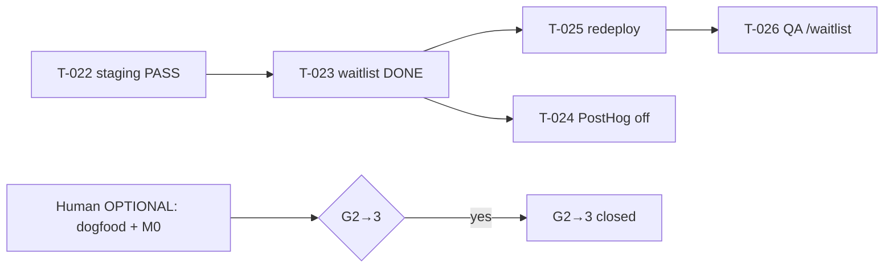

# Раздача задач — Quiet Partner

**Дата:** 2026-05-30 (Human sprint unblocked)  
**Gate:** G2→3 (spike + staging validated → dogfood + M0)  
**Канон очереди:** [`orchestration-queue.md`](../orchestration-queue.md)  
**PM status:** [`pm-status.md`](./pm-status.md)  
**Governance:** [`pm-governance.md`](./pm-governance.md)  
**Staging:** https://quiet-partner.vercel.app

---

## Режим PM-led (2026-05-30)

Human Architect делегировал операционный ритм PM: груминг, weekly status, раздача, gate prep — по [`pm-governance.md`](./pm-governance.md).  
**Human MUST:** M0 sign-off, Phase 5+ scope, budget/prod, внешние блокеры, waiver G2→3.  
**Human OPTIONAL (gate):** dogfood #1–5, API key в Vercel — **не блокируют** T-023 / T-024.

---

## Без Human (запускать агентов сейчас)

| Кто | Task | Что сделать | Команда / контекст |
|-----|------|-------------|-------------------|
| **Developer + DevOps** | **T-025** | Redeploy Vercel — `/waitlist` live | `Role: Developer` · `@docs/deploy-staging.md` |
| **QA** | **T-026** | Smoke `/waitlist` на staging (после T-025) | `Role: QA` · `@docs/landing-waitlist-one-pager.md` |
| **Developer** | **T-024** | PostHog stub OFF (параллельно T-025) | `Role: Developer` · `@knowledge-base/adr-002-analytics-posthog.md` |
| **PM** | — | Weekly `pm-status.md` **06.06**; journal | `Role: PM` |

**Уже закрыто (не вызывать):** T-001…T-028 (включ. staging, waitlist, PostHog stub, health, nav polish).

**Следующий без Human (PM groom → Developer):** T-029 API cost guardrails (Phase 4); redeploy staging для `/api/health` live.

**OPTIONAL Human (gate):** dogfood #1–5 (T-014); M0 sign-off (T-015); live BFF key (D2).

---

## Только Human (Pavel)

| # | Task | Действие | Артефакт |
|---|------|----------|----------|
| D1 | T-015 | **Go / Pause / Pivot** + sign-off в memo | [`m0-go-no-go-memo.md`](./m0-go-no-go-memo.md) |
| D2 | T-014, T-016 | `DEEPSEEK_API_KEY` в Vercel / `.env.local` | Не коммитить |
| D3 | T-014 | Забронировать **3–5** слотов 30–45 мин | — |
| — | T-014 | Dogfood **#1–5** (≥3 useful для G2→3) | [`dogfood-log-template.md`](./dogfood-log-template.md) |

---

## WBS — 2 недели (30.05–13.06.2026)

### Неделя 1 (30.05–06.06) — **факт на 30.05**

| Владелец | Task | Deliverable | Статус |
|----------|------|-------------|--------|
| UI/UX | T-020 | `docs/ux-reference-productmap.md` | ✅ DONE |
| Growth | T-019 | `docs/landing-waitlist-one-pager.md` | ✅ DONE |
| Developer + DevOps | T-018 | https://quiet-partner.vercel.app | ✅ DONE |
| Developer | T-021 | `knowledge-base/design-tokens.md` v1 | ✅ DONE |
| QA | T-022 | `qa-report-phase3.md` §Staging smoke PASS | ✅ DONE |
| PM | — | `pm-status.md` review **06.06** | 🔶 Ongoing |
| Human **OPTIONAL** | T-014 | Dogfood #1–#2 | ⬜ |

### Неделя 2 (07.06–13.06) — **план**

| Владелец | Task | Deliverable |
|----------|------|-------------|
| Developer | **T-025** | `/waitlist` 200 на vercel.app |
| Developer | **T-024** | `lib/analytics/posthog.ts` no-op; `.env.example` |
| QA | **T-026** | `qa-report-phase3.md` §Waitlist staging smoke |
| PM | T-014 / T-015 | Journal; memo evidence из dogfood (если есть) |
| Human **OPTIONAL** | T-014, T-015 | Dogfood #3–#5; **M0 sign-off** до 13.06 |

---

## Как активировать агента в Cursor

| Роль | Команда | Subagent | Контекст (@) |
|------|---------|----------|--------------|
| Developer | `Role: Developer` | `muster-developer` | `@docs/landing-waitlist-one-pager.md` |
| QA | `Role: QA` | `muster-qa` | `@docs/qa-report-phase3.md` |
| PM | `Role: PM` | `muster-pm` | `@docs/pm-status.md` |

---

## Блокеры gate G2→3

| Критерий | Статус |
|----------|--------|
| T-012 thresholds aligned | ✅ |
| T-013 browser smoke PASS | ✅ |
| T-016 prompt regression PASS (static) | ✅ |
| T-018 staging + T-022 smoke | ✅ |
| ≥3/5 dogfood «useful» | ⬜ (0/5) — **Human OPTIONAL (gate)** |
| T-015 M0 Human sign-off | ⬜ — **Human MUST** |

**Закрытие G2→3** — после dogfood + M0. **T-023/T-024** идут **параллельно** (PM waive M0 только для waitlist stub).

---

## Порядок (актуальный)

1. **Сейчас:** Developer **T-025** redeploy → QA **T-026**; параллельно Developer **T-024**.  
2. **Human OPTIONAL:** dogfood + API key + M0 sign-off (когда удобно).  
3. **После M0 Go:** полный waitlist backend / Phase 4 instrumentation.
