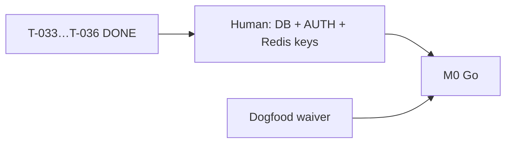

# Раздача задач — Quiet Partner

**Дата:** 2026-06-07 (Phase 5 prep sprint)  
**Gate:** G2→3 (dogfood + M0 Human) · G4→5 prep **active** (ADR-003 Accepted)  
**Канон очереди:** [`orchestration-queue.md`](../orchestration-queue.md)  
**PM status:** [`pm-status.md`](./pm-status.md)  
**Governance:** [`pm-governance.md`](./pm-governance.md)  
**Staging:** https://quiet-partner.vercel.app

---

## Режим PM-led (2026-06-07)

**Phase 5 prep DONE:** T-033…T-036. **Next:** post-M0 backlog (T-044+).  
**Human MUST:** `DATABASE_URL`, `AUTH_ENABLED=true`, `REDIS_URL`+`REDIS_TOKEN` on prod, M0 sign-off, billing.  
**Human OPTIONAL (G2→3):** dogfood #5 или waiver.

---

## Без Human (закрыто / READY)

| Кто | Task | Статус |
|-----|------|--------|
| Developer | T-001…T-043 | ✅ DONE |
| IT-Architect | T-033 ADR-003 Accepted | ✅ DONE |
| Developer | T-034 Drizzle schema spike | ✅ DONE |
| Developer | T-035 Auth scaffold (AUTH off) | ✅ DONE |
| Developer + DevOps | T-036 Redis rate limit scaffold | ✅ DONE |
| PM | M0 evidence, BACKLOG groom | ✅ DONE |

---

## Только Human (Pavel)

| # | Task | Действие | Артефакт |
|---|------|----------|----------|
| D1 | T-014 | Dogfood **#1–#4** | ✅ 2026-05-31 — **2/4 useful** |
| D2 | T-047 | Dogfood **#5** (+1 useful) **или** waiver G2→3 | §guides + log |
| D3 | T-015 | **Go / Pause / Pivot** + sign-off | [`m0-go-no-go-memo.md`](./m0-go-no-go-memo.md) |
| D4 | Phase 5 activation | `DATABASE_URL`, Neon/Supabase, `AUTH_ENABLED=true` | Vercel env |
| D5 | Billing | Stripe / subscriptions | Out of MVP |

---

## WBS — Phase 5 (текущий)

| Владелец | Deliverable | Статус |
|----------|-------------|--------|
| IT-Architect | ADR-003 Auth.js | ✅ Accepted |
| Developer | Drizzle schema draft | ✅ T-034 |
| Developer | Auth scaffold OFF | ✅ T-035 |
| Developer + DevOps | Redis per-user limits | ✅ T-036 (scaffold; keys Human) |
| Human | DB host (P5-ADR-2) + keys | ⬜ |
| Human | M0 + G2→3 waiver/useful | ⬜ |

---

## Порядок (актуальный)

1. **Human:** Neon/Supabase + `AUTH_ENABLED=true` + Upstash when готовы.  
2. **Параллельно:** dogfood #5 или waiver → M0 sign-off.
