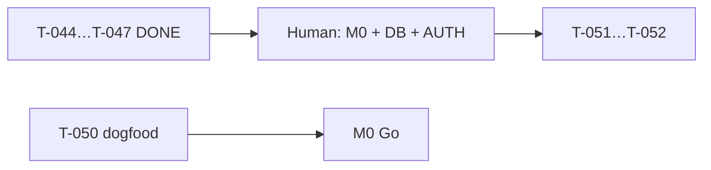

# Раздача задач — Quiet Partner

**Дата:** 2026-06-07 (Sprint 3 — T-044…T-047 DONE)  
**Gate:** G2→3 (dogfood + M0 Human) · G4→5 prep **active**  
**Канон очереди:** [`orchestration-queue.md`](../orchestration-queue.md)  
**PM status:** [`pm-status.md`](./pm-status.md)  
**Governance:** [`pm-governance.md`](./pm-governance.md)  
**Staging:** https://quiet-partner.vercel.app

---

## Режим PM-led (2026-06-07)

**Sprint 3 DONE:** T-044 waitlist API · T-045 LS migrate doc · T-046 QA Phase 5 · T-047 ADR-004 draft.  
**Human MUST:** `DATABASE_URL`, `AUTH_ENABLED=true`, Redis keys, M0 sign-off, billing.  
**Human OPTIONAL:** dogfood #5 / waiver G2→3; PostHog VPS (T-048).

---

## Без Human (закрыто)

| Кто | Task | Статус |
|-----|------|--------|
| Developer | T-001…T-043 | ✅ DONE |
| IT-Architect | T-033 ADR-003 · T-047 ADR-004 draft | ✅ DONE |
| Developer | T-034…T-036 Phase 5 scaffold | ✅ DONE |
| Developer | T-044 waitlist API + form wire | ✅ DONE |
| PM + Developer | T-045 localStorage migrate design | ✅ DONE |
| QA | T-046 Phase 5 prep checklist | ✅ DONE |

---

## Только Human (Pavel)

| # | Task | Действие | Артефакт |
|---|------|----------|----------|
| D1 | T-050 | Dogfood **#5** (+1 useful) **или** waiver G2→3 | §guides + log |
| D2 | T-015 | **Go / Pause / Pivot** + sign-off | [`m0-go-no-go-memo.md`](./m0-go-no-go-memo.md) |
| D3 | Phase 5 activation | Neon/Supabase + `DATABASE_URL` | ADR-004 one-liner |
| D4 | Phase 5 activation | `AUTH_ENABLED=true` + `AUTH_SECRET` | Vercel env |
| D5 | Billing | Stripe / subscriptions | Out of MVP |

---

## WBS — Sprint 3 (закрыт)

| Владелец | Deliverable | Статус |
|----------|-------------|--------|
| Developer | `POST /api/waitlist` (noop default) | ✅ T-044 |
| Developer | `/waitlist` form → API validation | ✅ T-044 |
| PM + Developer | `localstorage-migrate-phase5.md` | ✅ T-045 |
| QA | `qa-phase5-prep.md` | ✅ T-046 |
| IT-Architect | `adr-004-db-host-phase5.md` (Neon lean) | ✅ T-047 |

---

## Следующие владельцы

| Владелец | Task | Статус | Блокер |
|----------|------|--------|--------|
| **Human** | T-050 dogfood #5 / waiver | BACKLOG | — |
| **Human** | M0 sign-off | BACKLOG | G2→3 useful |
| **DevOps** | T-048 PostHog VPS | BACKLOG | OPTIONAL |
| **Senior PM + QA** | T-049 live LLM regression | BACKLOG | staging key OPTIONAL |
| **Developer** | T-051 Drizzle + waitlist postgres | BACKLOG | `DATABASE_URL` |
| **Developer** | T-052 migrate-from-local API | BACKLOG | AUTH on |

---

## Journal

| Дата | Событие |
|------|---------|
| 2026-06-07 | Phase 5 prep T-033…T-036 DONE |
| 2026-06-07 | PM groom sprint 3: T-044…T-046 READY (no live secrets) |
| 2026-06-07 | T-044…T-047 DONE; build/lint; deploy staging |

---

## Порядок

