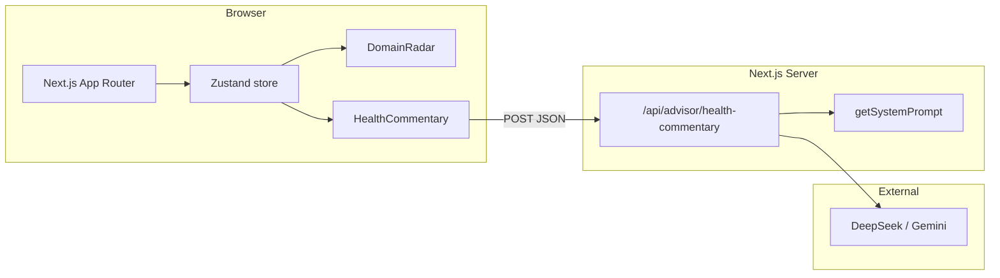

# Техническое задание — Тихий напарник (Quiet Partner)

**Версия:** 1.0  
**Владелец:** PM + IT-Architect  
**Аудитория:** Developer, IT-Architect, UI/UX, QA  
**Дата:** 2026-05-30  
**Статус:** Draft (Phase 0 → Phase 1)

> Связанные документы: [`implementation-plan.md`](./implementation-plan.md) · [`tech-stack.md`](./tech-stack.md) · [`../knowledge-base/product-brief.md`](../knowledge-base/product-brief.md)

---

## 1. Назначение и область {#1-назначение-и-область}

### 1.1 Назначение

**Тихий напарник** — web co-pilot для PM и лидов проектов на базе **PMBOK 7** (8 performance domains). Продукт визуализирует «здоровье» проекта через **DomainRadar**, генерирует короткий **HealthCommentary** через LLM (BFF) и проводит лёгкий **onboarding** для начальных оценок.

Продукт **не** является тренером по сертификации PMI и **не** выдаёт оценку «соответствия PMBOK».

### 1.2 Область MVP (Phase 0–3)

| В scope | Вне scope (Phase 0–3) |
|---------|------------------------|
| DomainRadar — 8 клинов, шкала 0–100 | Multi-tenant auth, billing |
| Zustand store (scores + project meta) | Jira / MS Project / Telegram |
| BFF `POST /api/advisor/health-commentary` | PostgreSQL persistence (Phase 5+) |
| HealthCommentary UI (loading / error / text) | Client-side LLM SDK с ключами |
| Onboarding 5–8 вопросов → initial scores | Официальные заявления PMI |
| RU labels; disclaimer | Vite SPA (отклонено) |

### 1.3 Роли и трассировка

| Роль | Ответственность по ТЗ |
|------|------------------------|
| IT-Architect | §2, §4 (безопасность LLM), §6, §8 |
| Developer | §3, §5, §6, реализация store/BFF |
| UI/UX | §3.1–3.6 (layout, a11y, tokens), DomainRadar |
| QA | §7 (критерии приёмки) |
| Senior PM | §3.5 (prompt rules), playbook сигналы |

---

## 2. Архитектура и стек {#2-архитектура-и-стек}

### 2.1 Общая схема



**Принцип:** все вызовы LLM — только через **BFF** (Next.js Route Handler). Ключи API **никогда** не попадают в client bundle.

### 2.2 Стек (канонический)

| Слой | Технология | Примечание |
|------|------------|------------|
| Framework | **Next.js 16** App Router | **Не Vite** — legacy DeepSeek диалог отменён |
| Язык | TypeScript | strict |
| Стили | Tailwind CSS v4, shadcn/ui | design tokens Phase 1 |
| State | Zustand | `domainScores`, `projectMeta`, `deliveryApproach` |
| Charts | Recharts (или SVG) | DomainRadar, 8 wedges |
| LLM | DeepSeek primary, Gemini optional | server-only env |
| Persistence | localStorage / session (spike) | PostgreSQL — Phase 5+ ADR |
| Deploy | Vercel или VPS | ADR T-004 |

### 2.3 Структура репозитория (целевая)

```
quiet-partner/
├── app/                    # pages + API routes
│   └── api/advisor/health-commentary/route.ts
├── components/             # DomainRadar, HealthCommentary, onboarding
├── lib/
│   ├── systemPrompt.ts     # getSystemPrompt()
│   └── store/              # Zustand (T-006)
├── knowledge-base/         # playbook, ADR
└── docs/                   # plan, TZ, roadmap
```

### 2.4 ADR-зависимости (T-004)

- `DEEPSEEK_API_KEY`, опционально `GEMINI_API_KEY` — только server env
- Запрет `NEXT_PUBLIC_*` для LLM ключей; CI grep secret patterns
- Rate limit на BFF; token cap на ответ
- Логирование без PII

---

## 3. Функциональные требования (по фазам) {#3-функциональные-требования}

### 3.1 Фаза 1 — Foundation {#31-фаза-1-foundation}

**Цель:** утверждённая архитектура LLM, design tokens, CI/build green.

| ID | Требование | AC |
|----|------------|-----|
| F1.1 | Bootstrap Next.js 16 + Tailwind + shadcn | T-001 DONE: build/lint OK |
| F1.2 | ADR-001 LLM BFF в `knowledge-base/adr-001-llm-bff.md` | secrets, fallback, rate limits |
| F1.3 | `architecture.md` + threat model (key leakage) | Architect sign-off |
| F1.4 | Design tokens stub + wireframe DomainRadar (8 wedges) | UI/UX deliverable |
| F1.5 | CI stub (lint + build) | green on main |

### 3.2 Фаза 2 — DomainRadar {#32-фаза-2-domainradar}

**Цель:** визуализация 8 доменов PMBOK 7 с субъективными оценками здоровья.

| ID | Требование | Детали |
|----|------------|--------|
| F2.1 | **8 клинов** radar chart | D1…D8 по playbook (RU labels) |
| F2.2 | Шкала **0–100** | Субъективное «воспринимаемое здоровье», не audit score |
| F2.3 | Пороги сигналов | **Green** ≥70, **Amber** 40–69, **Red** &lt;40 (настраиваемые константы) |
| F2.4 | Mock → store | Начально constants; после T-006 — из Zustand |
| F2.5 | Tailoring weights | predictive / adaptive / hybrid — default weights из playbook |
| F2.6 | a11y | SVG/text labels RU; table fallback; mobile ≥375px |
| F2.7 | Max 1 red highlight | UI: не более одного домена с акцентом «критично» (anti alert fatigue) |

**Домены (канон):**

| ID | RU label | Wedge |
|----|----------|-------|
| D1 | Заинтересованные стороны | 1 |
| D2 | Команда | 2 |
| D3 | Подход и жизненный цикл | 3 |
| D4 | Планирование | 4 |
| D5 | Работа проекта | 5 |
| D6 | Поставка | 6 |
| D7 | Измерение | 7 |
| D8 | Неопределённость | 8 |

### 3.3 Фаза 2 — Zustand store {#33-фаза-2-zustand-store}

| ID | Требование | AC |
|----|------------|-----|
| F2.8 | State: `domainScores: Record<DomainId, number>` | 8 ключей, 0–100 |
| F2.9 | State: `projectMeta` | name, phase hint, optional description |
| F2.10 | State: `deliveryApproach` | `predictive` \| `adaptive` \| `hybrid` |
| F2.11 | Actions | `setScore`, `setProjectMeta`, `setDeliveryApproach`, `hydrateFromOnboarding` (stub) |
| F2.12 | Types | Exported TS types для компонентов и BFF input |
| F2.13 | Persistence spike | optional localStorage sync (Phase 2) |

### 3.4 Фаза 2 — BFF `/api/advisor` {#34-фаза-2-bff-apiadvisor}

**Endpoint:** `POST /api/advisor/health-commentary`

| ID | Требование | AC |
|----|------------|-----|
| F2.14 | Validate input | domain scores, locale, deliveryApproach; 400 on invalid |
| F2.15 | Server-only LLM call | DeepSeek primary; Gemini fallback per ADR |
| F2.16 | Prompt assembly | `getSystemPrompt()` + domain context + top amber/red domains |
| F2.17 | Response shape | `{ commentary: string, questions?: string[], disclaimer: string }` |
| F2.18 | Error handling | 429 rate limit, 502 provider error — без утечки ключей |
| F2.19 | Token budget | max tokens ответа ≤512 (configurable env) |
| F2.20 | Cost logging | request id, token count, provider — **без PII** |

**Request body (draft):**

```typescript
{
  domainScores: Record<"D1"|"D2"|...|"D8", number>;
  deliveryApproach?: "predictive" | "adaptive" | "hybrid";
  locale?: "ru" | "en";
  projectMeta?: { name?: string; phase?: string };
}
```

### 3.5 Фаза 2 — HealthCommentary {#35-фаза-2-healthcommentary}

**Поведение UI + LLM (из DeepSeek диалога и `systemPrompt.ts`):**

| ID | Требование | AC |
|----|------------|-----|
| F2.21 | Questions-first | При thin context — 1–3 уточняющих вопроса **до** совета |
| F2.22 | Plain language RU | Без PMBOK jargon, пока пользователь сам не использует |
| F2.23 | Observable signals | Советы привязаны к amber/red доменам и playbook indicators |
| F2.24 | Uncertainty explicit | Допущения и неопределённость явно в тексте |
| F2.25 | No compliance claims | Запрет «официально соответствует PMBOK/PMI» |
| F2.26 | Disclaimer persistent | «Не сертификация PMBOK» — visible в UI card |
| F2.27 | UI states | loading skeleton, error retry, commentary text |
| F2.28 | Trigger | User action «Обновить комментарий» или auto on score change (debounced) |

**System prompt rules (канон):** см. `lib/systemPrompt.ts` — Senior PM review после T-003.

### 3.6 Фаза 3 — Onboarding {#36-фаза-3-onboarding}

| ID | Требование | AC |
|----|------------|-----|
| F3.1 | 5–8 вопросов plain language | RU; без exam jargon |
| F3.2 | Mapping → initial scores | Каждый вопрос влияет на 1–2 домена (weights doc) |
| F3.3 | deliveryApproach question | explicit predictive/adaptive/hybrid |
| F3.4 | Time to first radar | &lt;3 min (success metric) |
| F3.5 | Flow spec | step list / diagram в `knowledge-base/` или `docs/` (T-008) |
| F3.6 | Future UI task | T-009 (BACKLOG) — реализация UI onboarding |

**Примеры вопросов (черновик):**

1. Сколько параллельных проектов / workstreams?
2. Когда последний раз stakeholder менял ожидания?
3. Есть ли общий план на 2–3 недели?
4. Команда может сказать «нет» без наказания?
5. Был ли increment / demo за последние 2 недели?
6. Какой подход: сроки фиксированы (predictive) или итерации (adaptive)?

---

## 4. Нефункциональные требования {#4-нефункциональные-требования}

### 4.1 Безопасность

| ID | Требование |
|----|------------|
| NF-S1 | LLM API keys только server-side |
| NF-S2 | No `NEXT_PUBLIC_*` для секретов |
| NF-S3 | Input validation + max body size |
| NF-S4 | Rate limit per IP/session (ADR) |
| NF-S5 | Не логировать содержимое commentary с PII |

### 4.2 Доступность (a11y)

| ID | Требование |
|----|------------|
| NF-A1 | Radar: text labels + aria на wedges |
| NF-A2 | Table fallback для screen readers |
| NF-A3 | Focus order на HealthCommentary card |
| NF-A4 | Конtrast WCAG AA для green/amber/red |

### 4.3 Performance

| ID | Требование | Target |
|----|------------|--------|
| NF-P1 | First Contentful Paint (home) | &lt;2s local |
| NF-P2 | BFF p95 latency (excl. LLM) | &lt;200ms |
| NF-P3 | LLM response | &lt;8s p95 (provider dependent) |
| NF-P4 | Bundle: no client LLM SDK | — |

### 4.4 LLM quality

| ID | Требование |
|----|------------|
| NF-L1 | Questions-first при scores без контекста |
| NF-L2 | Block medical/legal definitive advice |
| NF-L3 | Sample log review 10% — Senior PM + QA |
| NF-L4 | Fallback provider при 5xx primary |

### 4.5 i18n

| ID | Требование |
|----|------------|
| NF-I1 | RU-first UI labels |
| NF-I2 | `locale` param для EN commentary (optional Phase 2) |

---

## 5. Модель данных {#5-модель-данных}

### 5.1 DomainId и scores

```typescript
type DomainId = "D1" | "D2" | "D3" | "D4" | "D5" | "D6" | "D7" | "D8";

type DomainScore = {
  id: DomainId;
  labelRu: string;
  value: number; // 0–100
  signal: "green" | "amber" | "red"; // derived from thresholds
};

function deriveSignal(value: number): "green" | "amber" | "red" {
  if (value >= 70) return "green";
  if (value >= 40) return "amber";
  return "red";
}
```

### 5.2 projectProfile

```typescript
type ProjectProfile = {
  name: string;
  deliveryApproach: "predictive" | "adaptive" | "hybrid";
  phase?: string;           // e.g. "discovery", "build", "beta"
  workstreamCount?: number;
  locale: "ru" | "en";
  updatedAt: string;        // ISO
};
```

### 5.3 HealthCommentary record (client)

```typescript
type HealthCommentaryState = {
  status: "idle" | "loading" | "success" | "error";
  commentary?: string;
  questions?: string[];
  disclaimer: string;       // default RU disclaimer constant
  errorMessage?: string;
  fetchedAt?: string;
};
```

### 5.4 Persistence (Phase 2 spike)

- Zustand → `localStorage` key `quiet-partner-v1`
- Phase 5+: PostgreSQL schema TBD (out of scope)

---

## 6. API контракты {#6-api-контракты}

### 6.1 POST `/api/advisor/health-commentary`

**Headers:** `Content-Type: application/json`

**Request:**

```json
{
  "domainScores": {
    "D1": 55, "D2": 72, "D3": 48, "D4": 61,
    "D5": 50, "D6": 38, "D7": 65, "D8": 44
  },
  "deliveryApproach": "hybrid",
  "locale": "ru",
  "projectMeta": { "name": "Пилот A", "phase": "build" }
}
```

**Response 200:**

```json
{
  "commentary": "Сейчас больше всего давят «Поставка» и «Неопределённость»…",
  "questions": [
    "Что можно показать stakeholder на этой неделе — даже черновик?",
    "Какой риск вы не записали, потому что «и так понятно»?"
  ],
  "disclaimer": "Комментарий носит advisory-характер и не является сертификацией или оценкой соответствия PMBOK/PMI."
}
```

**Errors:**

| Code | Body |
|------|------|
| 400 | `{ "error": "invalid_input", "details": "..." }` |
| 429 | `{ "error": "rate_limited" }` |
| 502 | `{ "error": "provider_unavailable" }` |

### 6.2 Будущие endpoints (Phase 5+, не MVP)

- `GET /api/project` — persistence
- `POST /api/onboarding/complete` — server-side profile (optional)

---

## 7. Критерии приёмки по компонентам (QA) {#7-критерии-приёмки}

### 7.1 DomainRadar (T-005)

- [ ] Отображает ровно 8 клинов с RU labels из playbook
- [ ] Scores 0–100; цвет wedge соответствует green/amber/red порогам
- [ ] Не более одного домена с усиленным red-callout
- [ ] Mobile 375px — chart не обрезается; labels читаемы
- [ ] Table fallback доступен с клавиатуры
- [ ] Mock data → после T-006 данные из store без перезагрузки

### 7.2 Zustand store (T-006)

- [ ] Все 8 domain keys; setScore обновляет UI
- [ ] deliveryApproach меняет default weights (если реализовано)
- [ ] TypeScript types экспортированы; no `any` в public API store
- [ ] hydrateFromOnboarding stub не ломает build

### 7.3 BFF `/api/advisor/health-commentary` (T-007)

- [ ] 400 на пустой/invalid body
- [ ] Ключ API не появляется в client bundle (`grep NEXT_PUBLIC`, network tab)
- [ ] Успешный ответ содержит disclaimer
- [ ] Rate limit срабатывает (manual test)
- [ ] Логи без текста commentary / PII

### 7.4 HealthCommentary UI (T-007)

- [ ] States: loading, error (+ retry), success
- [ ] Disclaimer visible до и после генерации
- [ ] Commentary на RU при locale=ru
- [ ] Нет текста «PMI approved» / «сертифицировано»

### 7.5 System prompt (T-003 review)

- [ ] Questions-first rule present
- [ ] No compliance claims rule present
- [ ] Plain language rule present

### 7.6 Onboarding spec (T-008)

- [ ] 5–8 вопросов documented
- [ ] Mapping вопрос → domain documented
- [ ] AC для T-009 (UI) вынесены отдельно

### 7.7 Regression / smoke

- [ ] `npm run build` && `npm run lint` green
- [ ] Home placeholder загружается
- [ ] `.env.example` документирует contract без реальных ключей

---

## 8. Зависимости и ограничения {#8-зависимости-и-ограничения}

| ID | Зависимость / ограничение |
|----|---------------------------|
| DEP-1 | T-004 ADR блокирует production BFF config |
| DEP-2 | T-003 playbook блокирует финальные RU labels и co-pilot copy |
| DEP-3 | Human предоставляет `DEEPSEEK_API_KEY` локально (не в git) |
| DEP-4 | Senior PM — part-time; prompt review не full-time SME |
| DEP-5 | Phase 0 validation — **desk research + dogfood**, без внешних интервью |
| DEP-6 | Stack **Next.js 16**, не Vite — non-negotiable |
| DEP-7 | English UI deferred до RU pilot validation |
| DEP-8 | PostgreSQL / auth — только Phase 5+ после ADR |

---

## 9. Трассировка: фаза плана → раздел ТЗ {#9-трассировка}

| Фаза плана | Пакет работ | Раздел ТЗ |
|------------|-------------|-----------|
| Phase 0 | Discovery, playbook | §1, §8 (DEP-5) |
| Phase 1 | Foundation, ADR, tokens | §3.1, §2, §4.1 |
| Phase 2 | DomainRadar | [§3.2](#32-фаза-2-domainradar) |
| Phase 2 | Zustand store | [§3.3](#33-фаза-2-zustand-store) |
| Phase 2 | BFF API | [§3.4](#34-фаза-2-bff-apiadvisor), [§6.1](#6-api-контракты) |
| Phase 2 | HealthCommentary | [§3.5](#35-фаза-2-healthcommentary) |
| Phase 3 | Onboarding | [§3.6](#36-фаза-3-onboarding) |
| Phase 3 | QA beta | [§7](#7-критерии-приёмки) |
| Phase 4 | Analytics, cost | §4.3, §8 (Phase 5+) |

---

## История документа

| Дата | Автор | Изменение |
|------|-------|-----------|
| 2026-05-30 | PM | v1.0 — первичное ТЗ для Phase 0–3 |
